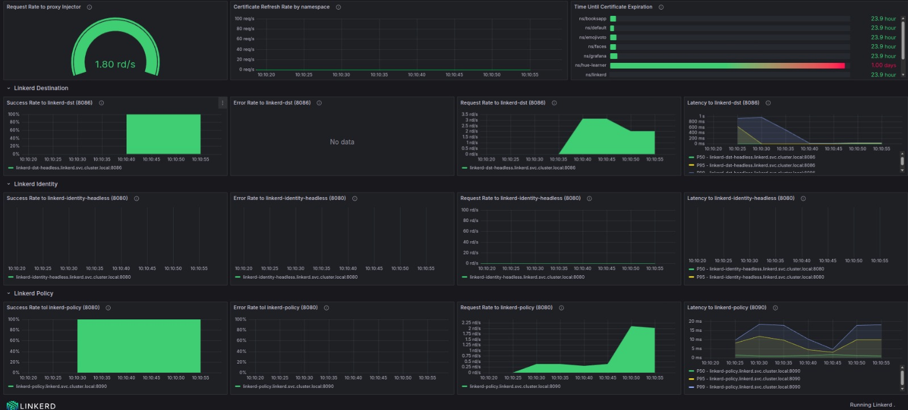

# Linkerd Control Plane Dashboard

A comprehensive Grafana dashboard for monitoring Linkerd control plane components, providing visibility into identity, destination, policy, and proxy injector metrics.

## Overview

This dashboard provides real-time monitoring capabilities for Linkerd's control plane components, helping you maintain observability over your service mesh infrastructure. It includes panels for tracking success rates, error rates, request rates, latency metrics, and certificate management across all critical control plane services.

## Features

### 🔍 **Proxy Injector Monitoring**
- Request rate to proxy injector
- Certificate refresh rate by namespace
- Certificate expiration time tracking

### 🎯 **Linkerd Destination Service**
- Success rate monitoring
- Error rate tracking
- Request rate metrics
- Latency percentiles (P50, P95, P99)

### 🛡️ **Linkerd Policy Service**
- Success/error rate monitoring
- Request rate tracking
- Response latency analysis

### 🔐 **Linkerd Identity Service**
- mTLS certificate lifecycle monitoring
- Identity service health metrics
- Certificate refresh patterns

## Dashboard Panels

The dashboard is organized into several sections:

1. **Certificate Management** - Monitor mTLS certificate health and lifecycle
2. **Linkerd Destination** - Track destination service performance
3. **Linkerd Destination / Policy** - Monitor policy service metrics
4. **Linkerd Identity** - Identity service monitoring and certificate management

## Prerequisites

- Grafana 11.6.0 or later
- Prometheus data source configured
- Linkerd service mesh deployed in your Kubernetes cluster
- Prometheus scraping Linkerd control plane metrics

## Installation

2. **Import the dashboard into Grafana:**
   - Open Grafana UI
   - Navigate to **Dashboards** → **Import**
   - Upload the content of  `control-plane.json` file
   - Configure the Prometheus data source when prompted

3. **Configure Data Source:**
   - Ensure your Prometheus data source is properly configured
   - The dashboard expects a data source variable named `DS_PROMETHEUS`

## Configuration

### Prometheus Data Source

Make sure your Prometheus instance is scraping the following Linkerd control plane metrics:

- `proxy_inject_admission_responses_total`
- `control_identity_cert_refreshes_total`
- `control_identity_cert_expiration_timestamp_seconds`
- `control_response_total`
- `control_response_latency_ms_bucket`

### Time Range

The dashboard is pre-configured with a 15-minute time window (`now-15m` to `now`), but this can be adjusted based on your monitoring needs.

## Screenshots

## Metrics Reference

### Key Metrics Monitored

| Metric | Description | Type |
|--------|-------------|------|
| `proxy_inject_admission_responses_total` | Proxy injector response count | Counter |
| `control_identity_cert_refreshes_total` | Certificate refresh events | Counter |
| `control_identity_cert_expiration_timestamp_seconds` | Certificate expiration timestamp | Gauge |
| `control_response_total` | Control plane response count | Counter |
| `control_response_latency_ms_bucket` | Response latency histogram | Histogram |

### Alert Thresholds

The dashboard includes visual thresholds for:
- Certificate expiration warnings (< 48 hours)
- Certificate expiration critical alerts (< 24 hours)
- High error rates
- Elevated response latencies

## Troubleshooting

### Common Issues

1. **No data displayed:**
   - Verify Prometheus data source configuration
   - Check that Linkerd control plane is running
   - Ensure Prometheus is scraping Linkerd metrics

2. **Certificate panels showing N/A:**
   - Confirm mTLS is enabled in your Linkerd installation
   - Verify identity service is running and healthy

3. **Missing service metrics:**
   - Check that all Linkerd control plane services are deployed
   - Verify service discovery is working correctly

## License

This project is licensed under the MIT License - see the [LICENSE](LICENSE) file for details.
